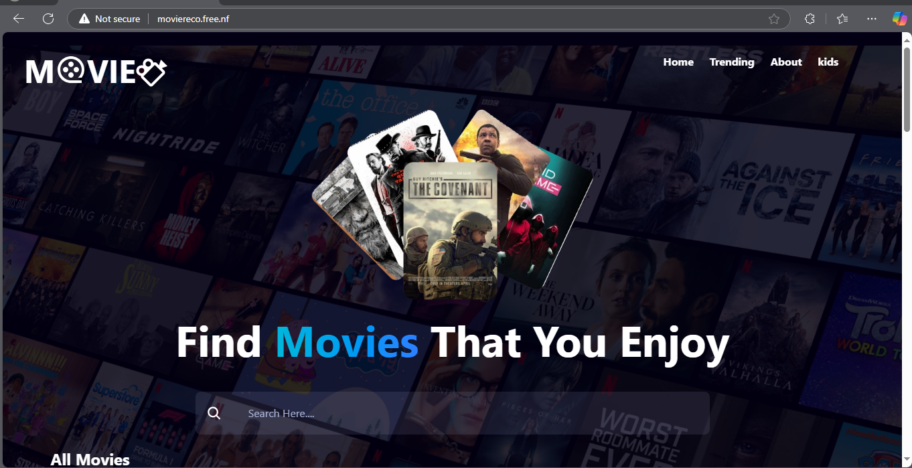
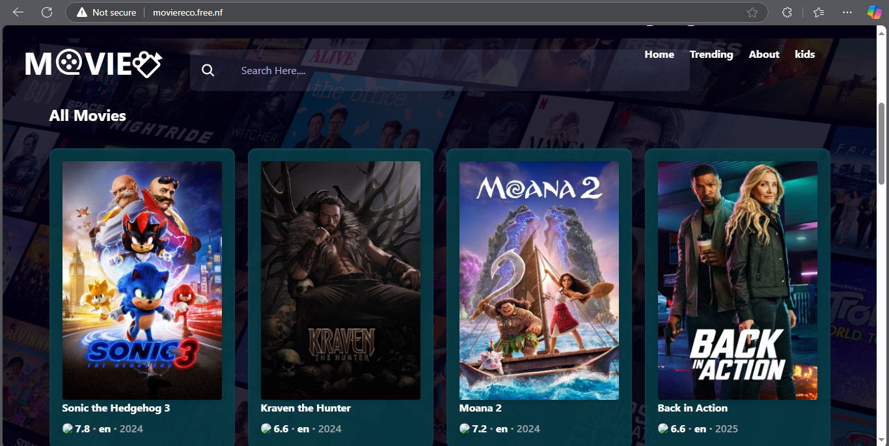
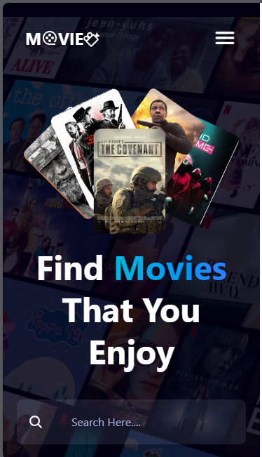

# Movie Searching App
Hi 👋, My name is Selamsew Dagne i am React and PHP developer, good at Mern Stack development.
## Overview

A movie searching web application that allows users to browse and search for movies using the TMDB API. Built with React and styled using Tailwind CSS, this app provides an intuitive and seamless experience for movie enthusiasts.

## Technologies Used

1. React – For building the user interface

2. Tailwind CSS – For styling and responsiveness

3. TMDB API – For fetching movie data

## Features

- Search for movies by title

- View detailed movie information, including ratings, release date, and synopsis

- Responsive design for mobile and desktop users

## Installation

1. Clone the repository:

> git clone https://github.com/selamde/MovieSearchingApp

2. Navigate to the project folder:

> cd movie-search-app

3. Install dependencies:

> npm install

4. Get your TMDB API key from TMDB and create .env.local file paste your api key in VITE_TMDB_API_KEY : 
   Get your api from https://developer.themoviedb.org/reference/intro/getting-started

> VITE_TMDB_API_KEY = your_api_key_here

5. Start the development server:
npm start

## Usage

- Open the app in your browser at http://localhost:5173/

- Enter a movie title in the search bar to find movies

- I hosted it on infinite free you can preview it with this link: http://moviereco.free.nf/
  

## App looks like this

- Desktop view and Mobile view

